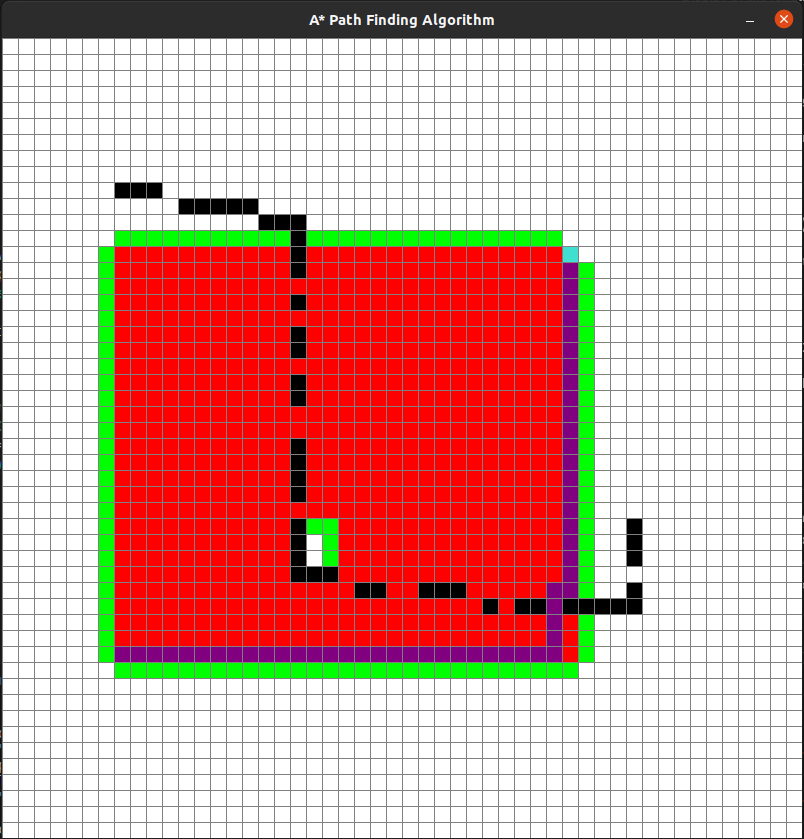
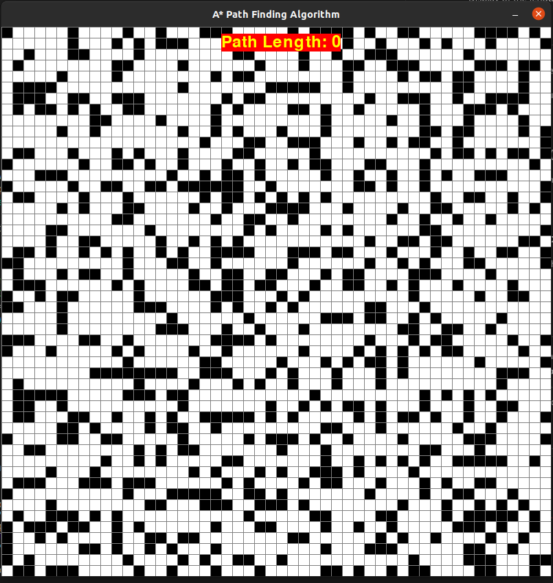

# A* Path Finding Algorithm Visualization

This project implements the A* pathfinding algorithm and provides a visualization using Pygame. The application allows users to create different types of grids, including a free-style grid, a random maze, and a warehouse-like grid. Users can place the start and end points and add barriers to observe the A* algorithm finding the shortest path.

## Table of Contents
- [Features](#features)
- [Grid Types](#grid-types)
- [Controls](#controls)
- [Screenshots](#screenshots)
- [License](#license)

## Features

- A* pathfinding algorithm visualization.
- Three types of grids: Free-style, Random maze, and Warehouse grid.
- Interactive grid creation and obstacle placement.
- Real-time visualization of the algorithm's progress.
- Display of the length of the found path.

## Grid Types

### Free Style Grid (Type 0)
Allows users to create a custom grid.

### Random Maze Grid (Type 1)
Generates a maze with random obstacles.

### Warehouse Grid (Type 2)
Creates a grid with a warehouse-like maze layout.

## Controls

- **Left Mouse Button:** Place start, end points, or barriers.
- **Right Mouse Button:** Remove obstacles.
- **Space Key:** Run the A* algorithm to find the path.
- **C Key:** Clear the grid and start over.

## Screenshots

Include screenshots or GIFs showcasing the application and its features.

## License

This project is licensed under the [MIT License](LICENSE).

**Based on the tutorial by Tech With Tim:** [A* Pathfinding Visualization Tutorial](https://www.youtube.com/watch?v=JtiK0DOeI4A)
